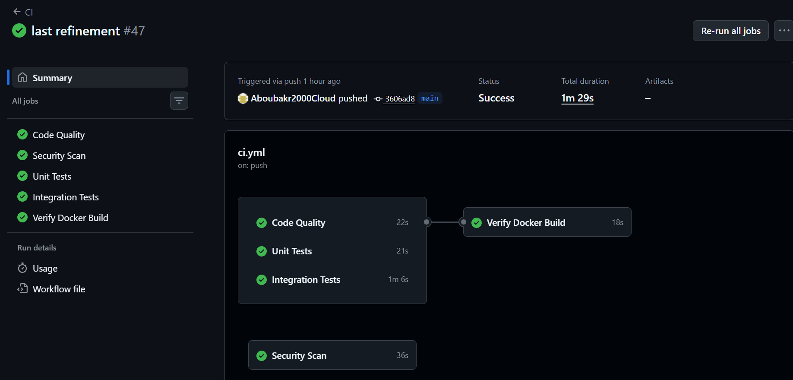
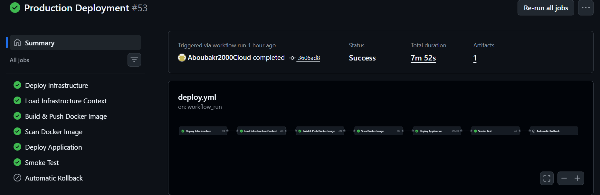
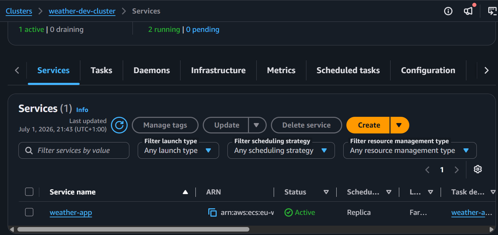
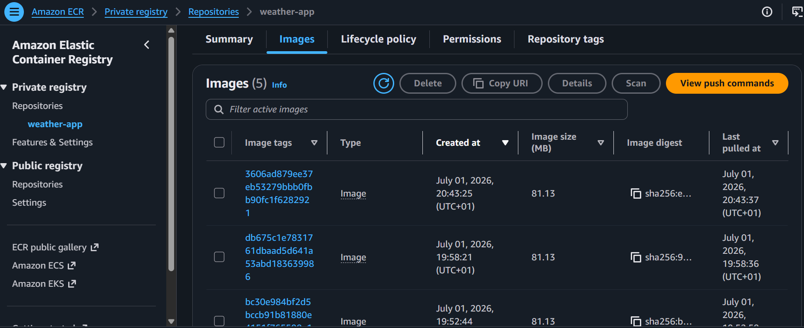
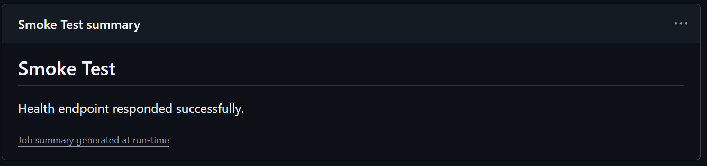
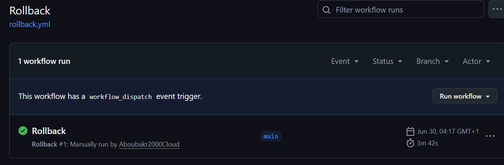
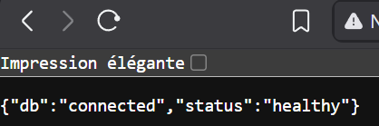

# 🚀 Week 19 — Production-Inspired CI/CD Pipeline for AWS ECS Weather Platform

> **Cloud Engineering Roadmap** · Week 19 of 24

A production-inspired CI/CD pipeline built around a containerized Flask weather application deployed on **Amazon ECS Fargate** using **Terraform** and **GitHub Actions**.

This project automates the complete software delivery lifecycle—from validating code quality and running automated tests to provisioning AWS infrastructure, building Docker images, deploying new ECS task definitions, validating deployments through smoke tests, and supporting rollback strategies.

Rather than simply deploying an application, the objective of this project was to design a reliable deployment workflow that follows modern DevOps practices while remaining fully reproducible through Infrastructure as Code.

---

# 🎯 Project Goals

The main objectives of this project were:

* Build a complete Continuous Integration pipeline
* Automate infrastructure deployment using Terraform
* Deploy Docker images automatically to Amazon ECS
* Scan source code and container images for security issues
* Execute automated smoke tests after deployment
* Support automatic and manual rollback strategies
* Reduce unnecessary deployments using change detection
* Follow production-oriented DevOps practices

---

# 🏗️ End-to-End Architecture

```text
     Developer
        │
             ▼
     Git Push
        │
             ▼
 GitHub Actions (CI)
─────────────────────────────────
• Quality Checks
• Unit Tests
• Integration Tests
─────────────────────────────────
        │
             ▼
Production Deployment
─────────────────────────────────
Terraform Apply
        │
             ▼
Terraform Plan + Artifact
        │
             ▼
Load Infrastructure Context
        │
             ▼
Build Docker Image
        │
             ▼
Security Scan (Trivy)
        │
             ▼
Push Image to Amazon ECR
        │
             ▼
Deploy to Amazon ECS
        │
             ▼
Smoke Test (ALB)
        │
   ┌────┴────┐
   │         │
Success   Failure
   │         │
     ▼              ▼
 Complete  Automatic Rollback
```

---

# 📁 Repository Structure

```text
ecs-weather-platform-cicd/
│
├── app/
│   ├── app.py
│   └── templates/
│       └── index.html
│
├── migrations/
│
├── scripts/
│   └── smoke-test.sh
│
├── tests/
│   ├── unit/
│   ├── integration/
│   └── conftest.py
│
├── terraform/
│   ├── backends/
│   ├── envs/
│   ├── modules/
│   ├── main.tf
│   ├── variables.tf
│   ├── outputs.tf
│   ├── iam.tf
│   └── locals.tf
│
├── nginx/
│   └── default.conf
│
├── .github/
│   └── workflows/
│       ├── ci.yml
│       ├── deploy.yml
│       └── rollback.yml
│
├── Dockerfile
├── requirements.txt
├── requirements-dev.txt
└── README.md
```

---

# ⚙️ Technologies Used

## Cloud

* Amazon ECS (Fargate)
* Amazon ECR
* Amazon RDS
* Application Load Balancer
* IAM
* AWS Secrets Manager

## Infrastructure

* Terraform
* Modular Terraform Architecture
* Remote State Backend

## Application

* Python 3.11
* Flask
* MySQL
* PyMySQL

## Containers

* Docker
* Multi-stage Builds

## CI/CD

* GitHub Actions

## Quality & Security

* Black
* Flake8
* Pytest
* Pytest Coverage
* Hadolint
* TFLint
* Trivy

---

# 🔄 Continuous Integration (CI)

Every push triggers a complete validation pipeline before any deployment is allowed.

The CI workflow contains four independent jobs that execute in parallel whenever possible.

```text
                Push / Pull Request
                        │
                                        ▼
                 Quality Checks
                        │
        ┌───────────────┼───────────────┐
             ▼                         ▼                        ▼
   Unit Tests    Integration Tests   Docker Build
        │               │               │
        └───────────────┼───────────────┘
                                        ▼
                   CI Completed
```

## Quality Checks

The Quality job validates the overall health of the project.

Checks performed:

* Black formatting
* Flake8 linting
* Terraform fmt
* Terraform validate
* TFLint
* Hadolint

This ensures formatting consistency, infrastructure validation, and Docker best practices before deployment begins.

## Unit Tests

Unit tests validate application logic without relying on external services.

Current coverage includes:

* Health endpoint
* Weather endpoint
* History endpoint
* Database mocking

External dependencies are mocked where appropriate to keep unit tests fast and deterministic.

## Integration Tests

Integration tests validate communication with the real database.

Tests verify:

* Database connectivity
* Schema validation
* Data insertion
* Data retrieval

Unlike unit tests, these confirm that the application interacts correctly with actual infrastructure.

## Docker Verification

Before deployment, the Docker image is built to ensure:

* Dockerfile remains valid
* Dependencies install successfully
* Runtime image builds without errors

This prevents deployment failures caused by broken container images.

---

# 🚀 Continuous Deployment (CD)

Deployment is automatically triggered only after the CI workflow completes successfully.

The deployment pipeline performs:

* Terraform validation and deployment
* Terraform execution plan generation
* Upload of the execution plan as a workflow artifact
* Docker image build and push to Amazon ECR
* Container vulnerability scanning using Trivy
* ECS deployment with task definition revision
* Application smoke testing through the Application Load Balancer
* Automatic rollback if deployment verification fails

```text
                   CI Successful
                         │
                                         ▼
               Deploy Infrastructure
                         │
                                         ▼ 
             Load Infrastructure Context
                         │
                                         ▼
             Build and Push Image to ECR
                         │
                                         ▼
                 Scan Docker Image
                         │
                                         ▼
                 Deploy ECS Service
                         │
                                         ▼
                  Run Smoke Tests
                         │
             ┌───────────┴───────────┐
             │                       │
                      ▼                                     ▼
        Deployment OK         Automatic Rollback
```

---

# ☁️ Infrastructure Deployment

Infrastructure is managed entirely with Terraform.

The deployment workflow automatically:

* Initializes Terraform
* Validates configuration
* Applies infrastructure changes
* Retrieves infrastructure outputs
* Passes outputs to subsequent deployment jobs

Resources managed include:

* VPC
* Public & Private Subnets
* Internet Gateway
* NAT Gateway
* Route Tables
* Security Groups
* Application Load Balancer
* ECS Cluster
* ECS Service
* ECS Task Definition
* Amazon ECR Repository
* Amazon RDS
* Secrets Manager
* IAM Roles

Terraform remains the single source of truth for infrastructure.

---

# 🐳 Docker Improvements

The application image was redesigned using several production-inspired practices.

### Multi-stage Build

Separate build and runtime stages reduce the final image size by excluding unnecessary build artifacts.

### Dedicated Runtime Environment

Only the packages required to run the application are included in the final image.

### Non-root User

The container runs under a dedicated application user instead of the root account.

Benefits:

* Reduced privilege exposure
* Improved container security
* Better alignment with container best practices

### Pinned Base Image

The runtime image uses a pinned base image digest to ensure deterministic builds and reduce unexpected changes from upstream images.

---

# 🏗️ Terraform Improvements

The Terraform configuration was refactored to improve consistency and maintainability.

Improvements include:

* Modular infrastructure design
* Shared `common_tags` across resources
* Required Terraform version declarations
* Required provider version constraints
* Removal of unused variables and locals
* Consistent module interfaces
* Reusable outputs between modules

These improvements also resulted in a clean TFLint validation.

📦 Terraform Planning

Before infrastructure changes are applied, the pipeline:

* Generates a Terraform execution plan
* Creates a human-readable plan.txt
* Uploads both the binary plan and text plan as GitHub Actions artifacts
* Applies the exact generated plan

This mirrors a production-style Infrastructure-as-Code workflow and improves deployment traceability.

---

# 🔐 Security & Quality Gates

Security validation is integrated directly into the deployment pipeline.

## Trivy

Container images are scanned for known vulnerabilities before deployment.

The workflow blocks deployments if critical vulnerabilities with available fixes are detected.

---

## Hadolint

The Dockerfile is validated against Docker best practices.

Checks include:

* Layer optimization
* Package installation practices
* General Docker recommendations

---

## TFLint

Terraform configurations are validated to detect:

* Unused variables
* Missing provider constraints
* Terraform best-practice violations
* Configuration inconsistencies

---

# 🧪 Testing Strategy

Testing is divided into multiple layers to validate different parts of the system.

```text
             Testing Pyramid

               Integration
             ───────────────
           Real Database Tests

                Unit Tests
        Application Logic + Mocking

            Quality Validation
        Formatting • Linting • Docker
```

### Unit Tests

Unit tests validate individual application components while mocking database interactions when appropriate.

Examples:

* `/health`
* `/weather`
* `/api/history`

---

### Integration Tests

Integration tests validate communication with the deployed MySQL database.

They verify:

* Connection
* Table schema
* Insert operations
* Query operations

---

### Smoke Tests

After deployment, the application is validated through automated smoke tests.

Checks include:

* Health endpoint
* API endpoint availability
* HTTP response validation
* Basic response-time verification

Deployment is considered successful only if these tests pass.

---

# 🌐 Deployment Flow

Every successful deployment follows the same sequence:

1. Deploy infrastructure
2. Load infrastructure context
3. Build Docker image
4. Push image to Amazon ECR
5. Scan container image
6. Register a new ECS task definition
7. Update the ECS service
8. Wait until the service becomes stable
9. Execute smoke tests
10. Complete deployment or trigger rollback

This creates a repeatable deployment process that requires minimal manual intervention.

---

# 🔄 Rollback Strategy

Reliability is just as important as deployment.

Two rollback mechanisms are implemented.

## Automatic Rollback

If deployment completes but smoke tests fail:

* The previous ECS task definition is restored automatically.
* The ECS service waits until it becomes stable again.
* Smoke tests are executed once more to verify recovery.

---

## Manual Rollback

A dedicated GitHub Actions workflow allows operators to roll back the application manually.

Safety features include:

* Environment approval
* Explicit confirmation before execution
* Automatic selection of the previous task definition
* Smoke test validation after rollback

This provides a safe recovery mechanism without modifying infrastructure.

---

# 📸 Suggested Screenshots

The following screenshots demonstrate the complete pipeline in action.

## CI Workflow



---

## Deployment Workflow



---

## ECS Service



---

## Amazon ECR



---

## Smoke Test Summary



---

## Rollback Workflow



---

## Application Health Endpoint

Example:

```json
{
  "status": "healthy",
  "db": "connected"
}
```



---

# 🧩 Engineering Challenges & Solutions

Building the pipeline was not simply a matter of writing YAML files. Throughout the project, several real-world issues were encountered and resolved. Each challenge helped deepen my understanding of cloud infrastructure, CI/CD pipelines, Docker, Terraform, and AWS.

---

## 🐍 Challenge 1 — Python Import Issues in GitHub Actions

### Problem

Unit tests executed successfully on the local machine but failed inside GitHub Actions because Python could not correctly locate the application package.

### Solution

* Reorganized the project package structure.
* Corrected application imports.
* Simplified the testing layout.
* Added debugging steps to validate imports inside the CI runner before executing environment.

### Outcome

The testing environment became consistent across local development and GitHub Actions, allowing unit tests to execute reliably.

---

## 🗄️ Challenge 2 — Unit Tests Depending on External Services

### Problem

Some unit tests depended on a live database and external weather API responses, making test execution unreliable.

### Solution

* Mocked database connections using pytest and unittest.mock.
* Mocked external API requests.
* Isolated application logic from infrastructure dependencies.

### Outcome

Unit tests became deterministic, faster, and completely independent of external services.

---

## 🏗️ Challenge 3 — Infrastructure State & Deployment Synchronization

### Problem

The deployment workflow initially attempted to build and deploy the application before the required AWS infrastructure outputs were available.

### Solution

* Refactored the deployment workflow into sequential stages.
* Deployed infrastructure before application deployment.
* Loaded Terraform outputs only after infrastructure was successfully created.
* Introduced a dedicated infrastructure context stage shared by subsequent jobs.

### Outcome

Infrastructure and application deployments are now fully synchronized, ensuring every deployment stage receives the correct AWS resource information.

---

## 🐳 Challenge 4 — Docker Build Reliability

### Problem

Docker image builds initially failed because of Buildx configuration issues, image-tagging problems, and dependency management inside the Dockerfile.

### Solution

* Corrected Docker image tagging.
* Refined the multi-stage Docker build.
* Introduced a dedicated Python virtual environment during the build stage.
* Reduced the final image size by separating build and runtime environments.
* Applied Docker security best practices such as running the application as a non-root user and pinning the base image by digest.

### Outcome

The pipeline now consistently produces lightweight, reproducible, and production-ready container images.

---

## 🔒 Challenge 5 — Container Security

### Problem

Building a Docker image successfully does not guarantee that it is secure enough for deployment. The deployment pipeline required an automated way to detect critical vulnerabilities before releasing a new version.

### Solution

* Integrated **Trivy** image scanning into the deployment workflow.
* Updated vulnerable Python dependencies.
* Pinned the Docker base image by digest.
* Configured the pipeline to block deployments only when critical vulnerabilities are detected.

### Outcome

Every deployment now passes through an automated security validation stage before reaching production.

---

## ☁️ Challenge 6 — ECS Deployment Automation

### Problem

The ECS deployment workflow initially failed because required deployment information—such as the ECR image URI, ECS task definition, cluster name, and service name—was not consistently propagated between workflow jobs.

### Solution

* Reviewed and simplified workflow dependencies.
* Standardized job outputs.
* Introduced a dedicated infrastructure context stage to expose Terraform outputs.
* Automated ECS task definition rendering and service deployment using official AWS GitHub Actions.

### Outcome

The deployment pipeline now performs a fully automated application deployment from Docker image creation through ECS service update.

---

## 🔄 Challenge 7 — Deployment Recovery

### Problem

A production deployment requires a reliable recovery mechanism whenever a newly deployed application version becomes unhealthy.

### Solution

Implemented two complementary recovery strategies:

* Automatic rollback after failed smoke tests.
* Manual rollback workflow protected by GitHub Environment approval.

### Outcome

The platform can safely recover from unsuccessful deployments while maintaining application availability.

---

## 📋 Challenge 8 — Safe Infrastructure Changes

### Problem

Applying Terraform changes directly provides little visibility into the infrastructure modifications that will occur, making deployments harder to review and audit.

### Solution

* Added a dedicated Terraform planning stage before infrastructure deployment.
* Generated both a binary execution plan (`tfplan`) and a human-readable plan (`plan.txt`).
* Uploaded both files as GitHub Actions artifacts.
* Applied the exact generated execution plan to guarantee consistency between planning and deployment.

### Outcome

Infrastructure deployments became more transparent, reproducible, and aligned with production Infrastructure-as-Code practices.


---

# 💡 Key Concepts Learned

This project strengthened practical experience in:

* Continuous Integration
* Continuous Deployment
* GitHub Actions workflow design
* Infrastructure as Code with Terraform
* Docker image optimization
* ECS deployment strategies
* Automated rollback techniques
* Infrastructure modularization
* Security scanning
* Automated testing
* AWS service integration
* CI/CD troubleshooting and debugging

More importantly, it demonstrated that building a deployment pipeline involves much more than writing configuration files. Understanding dependencies between services, debugging failures, and designing reliable automation are equally important parts of the engineering process.

---

# 🔮 Future Improvements

Potential enhancements for future iterations include:

* Blue/Green deployments
* Canary deployments
* Multi-environment promotion (Development → Staging → Production)
* CloudWatch dashboards and alarms
* Deployment notifications (Slack or Microsoft Teams)
* Automatic dependency update workflows
* Enhanced unit-test coverage
* Performance and load testing
* GitHub Environments with multiple approval stages

---

# 📸 Final Result

At the end of this project, the application can be delivered through a complete automated pipeline:

```text
Developer
    │
      ▼
Git Push
    │
      ▼
Quality Checks
    │
      ▼
Automated Testing
    │
      ▼
Docker Build
    │
      ▼
Security Scanning
    │
      ▼
Terraform Apply
    │
      ▼
Push Image to Amazon ECR
    │
      ▼
Deploy to Amazon ECS
    │
      ▼
Smoke Tests
    │
      ▼
Success ✅
    │
    └──────────────► Automatic / Manual Rollback if required
```

---

# 🏁 Conclusion

This project transformed a manually deployed Flask application into a production-inspired deployment platform powered by GitHub Actions, Docker, Terraform, and Amazon ECS.

Beyond implementing CI/CD automation, the project emphasized debugging, reliability, infrastructure consistency, and deployment safety. Many of the most valuable lessons came from diagnosing workflow failures, understanding how different AWS services interact, and refining the pipeline until each stage operated reliably.

The resulting solution provides a repeatable deployment process with integrated quality checks, automated testing, security validation, infrastructure management, smoke testing, and rollback capabilities—bringing the application significantly closer to modern cloud engineering practices.

---

## 👤 Author

**Aboubakr**

Cloud Engineering Roadmap — Week 19

Building production-inspired cloud solutions one project at a time. ☁️🚀

