# ☁️ ECS Weather Platform – Monitoring & Observability


Building a complete monitoring and observability stack for a production-style AWS ECS application using Terraform, Amazon CloudWatch, Amazon SNS, CloudWatch Logs Insights, Custom Metrics, and AWS Budgets.

---

# 📖 Overview

This project extends the ECS Weather Platform by adding a complete monitoring solution.

Instead of simply deploying infrastructure, the platform now provides visibility into application health, infrastructure performance, logs, alarms, custom metrics, and cloud costs.

Everything is fully provisioned using **Terraform**.

> This project evolved through several stages — this version adds monitoring. See [ecs-weather-platform-secured](https://github.com/Aboubakr2000Cloud/ecs-weather-platform-secured) for the current, fully hardened version.

---

# 🏗️ Architecture

```text
                           Internet
                               │
                               ▼
                     Application Load Balancer
                               │
                ┌──────────────┴──────────────┐
                ▼                             ▼
           ECS Task                     ECS Task
          Weather API                 Weather API
                │
                ▼
          Amazon RDS (MySQL)

────────────────────────────────────────────────────────────

Application Logs
        │
        ▼
CloudWatch Logs
        │
        ▼
Logs Insights Queries

────────────────────────────────────────────────────────────

ECS Metrics
ALB Metrics
RDS Metrics
Custom Application Metrics
        │
        ▼
CloudWatch Metrics
        │
        ▼
CloudWatch Alarms
        │
        ▼
Composite Alarm
        │
        ▼
SNS Topic
        │
        ▼
Email Notifications

────────────────────────────────────────────────────────────

AWS Budgets
        │
        ▼
Cost Notifications
```

---

# 🏗️ High-Level Architecture

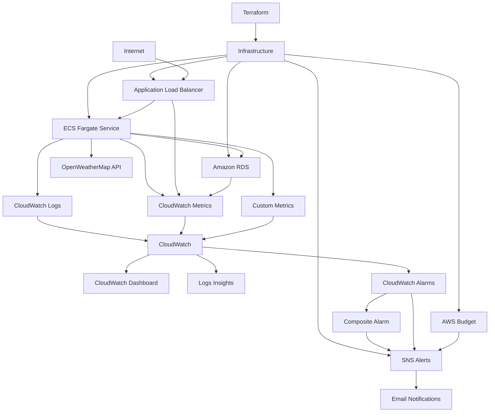

---

# 🚀 Features

* Infrastructure fully managed with Terraform
* Modular monitoring module
* CloudWatch Dashboard
* CloudWatch Metric Alarms
* Composite Alarm
* CloudWatch Logs Insights
* Custom CloudWatch Metrics
* SNS Email Notifications
* AWS Budget Monitoring
* ECS Container Insights
* Log retention configuration
* Production-style observability

---

# 📂 Project Structure

```text
terraform/
│
├── modules/
│   ├── alb/
│   ├── ecs/
│   ├── monitoring/
│   ├── networking/
│   ├── rds/
│   └── ...
│
├── envs/
├── main.tf
├── variables.tf
└── outputs.tf
```

---

# 📊 CloudWatch Dashboard

A centralized dashboard provides a real-time overview of the platform.

Widgets include:

* ECS CPU Utilization
* ECS Memory Utilization
* ALB Request Count
* ALB Target Response Time
* RDS Connections
* Alarm Status
* Recent Application Errors

The dashboard becomes the primary operational view for the application.

---

# 🚨 CloudWatch Alarms

The monitoring module creates the following alarms automatically:

| Alarm            | Purpose                              |
| ---------------- | ------------------------------------ |
| ECS High CPU     | CPU utilization exceeds threshold    |
| ECS High Memory  | Memory utilization exceeds threshold |
| ALB 5XX Errors   | Detect application failures          |
| ALB High Latency | Detect slow responses                |
| RDS High CPU     | Detect database overload             |
| RDS Low Storage  | Detect storage exhaustion            |

A **Composite Alarm** is also created:

```
High ECS CPU
AND
ALB 5XX Errors
```

This reduces unnecessary alert noise by notifying only when multiple symptoms occur simultaneously.

---

# 📧 SNS Notifications

All alarms publish notifications to a single SNS topic.

Workflow:

```
CloudWatch Alarm
        │
        ▼
SNS Topic
        │
        ▼
Email Notification
```

Manual alarm testing was performed using:

```bash
aws cloudwatch set-alarm-state
```

Both **ALARM** and **OK** notifications were successfully received.

---

# 📈 Container Insights

Amazon ECS Container Insights was enabled to monitor:

* Running Tasks
* CPU Utilization
* Memory Utilization
* Network RX
* Network TX
* Per-task metrics
* Service-level metrics

This provides detailed visibility into ECS workloads.

---

# 📜 CloudWatch Logs Insights

Application logs are stored in CloudWatch Logs with a retention period of **30 days**.

Useful queries include:

### Error Rate

```sql
fields @timestamp, @message
| filter @message like /ERROR/ or @message like /500/
| stats count(*) as errors by bin(1h)
```

---

### Weather Requests by City

```sql
fields @message
| filter @message like /GET \/weather\//
| parse @message 'GET /weather/* HTTP' as city
| stats count(*) as requests by city
| sort requests desc
```

---

### Slow Requests

```sql
fields @timestamp, @message
| filter @message like /GET/
| parse @message '"* * HTTP/* *" * *' as method, path, version, status, bytes, duration
| filter duration > 1000
```

---

### Ignore Health Checks

```sql
fields @timestamp, @message
| filter @message not like /GET \/health/
```

---

# 📡 Custom CloudWatch Metrics

The application publishes custom metrics using **boto3**.

Metrics include:

* WeatherFetched
* WeatherAPILatency
* WeatherFetchError

Example dimensions:

```
City = London
City = Paris
City = Montreal
```

These metrics can be used for future dashboards and alarms.

---

# 💰 AWS Budget Monitoring

A monthly AWS Budget is configured.

Features:

* Monthly cost tracking
* Forecasted spend
* 80% notification threshold
* 100% notification threshold

This helps prevent unexpected AWS costs.

---

# 🧪 Validation Performed

The monitoring stack was validated by performing the following tests:

* Generated application traffic
* Verified CloudWatch metrics
* Verified dashboard updates
* Executed Logs Insights queries
* Triggered CloudWatch alarms manually
* Confirmed SNS email notifications
* Published custom metrics
* Verified AWS Budget creation

---

# 📸 Output screenshots

* CloudWatch Dashboard

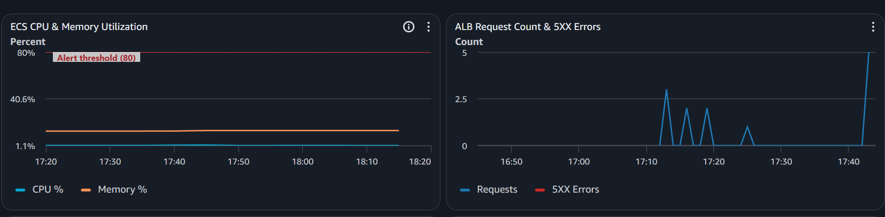
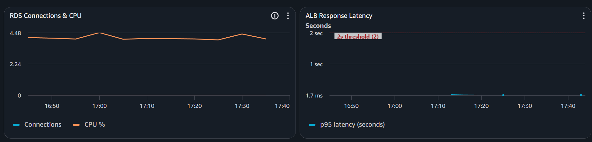
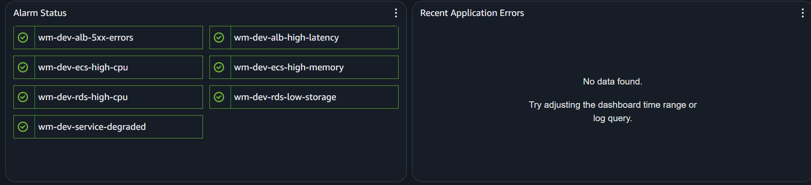

---

* ECS Container Insights

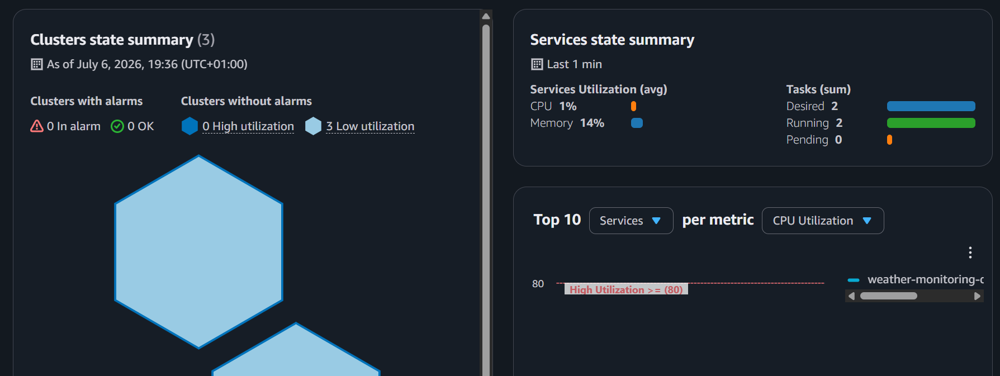

---

* CloudWatch Alarms

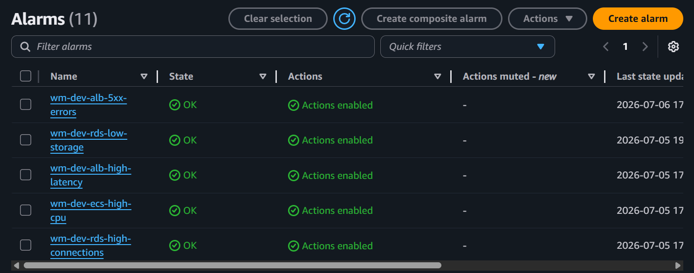

---

* Composite Alarm

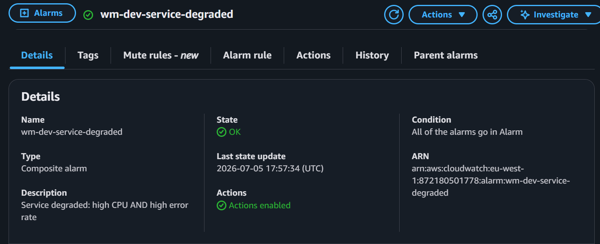

---

* SNS Subscription

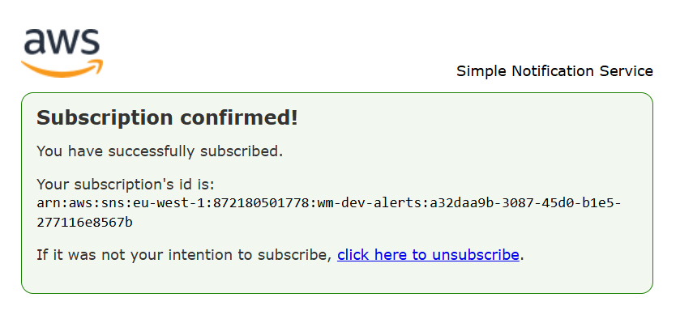

---

* Email Notification

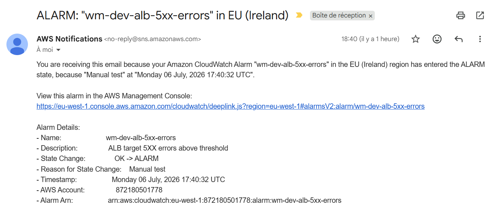

---

* Logs Insights Query Results

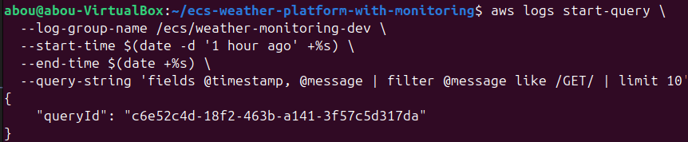

---

* Custom Metrics Namespace

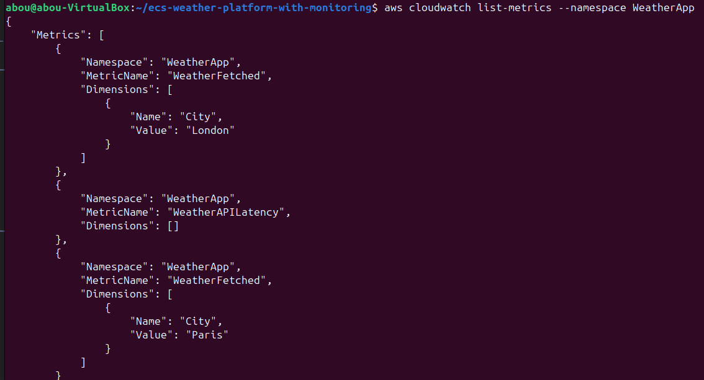

---

* AWS Budget

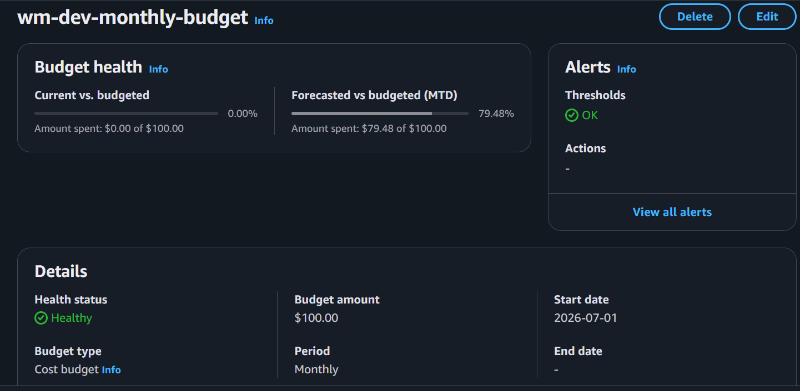

---

* Terraform Apply

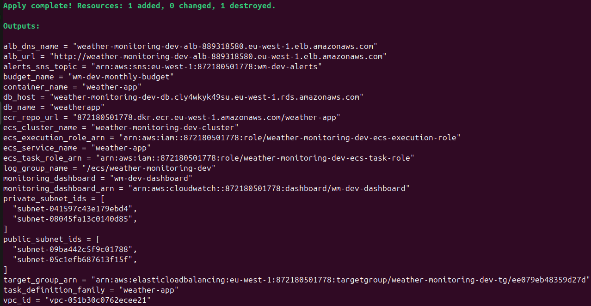

---

# ⚠️ Lessons Learned

* CloudWatch metrics are not real-time and typically update within 1–2 minutes.
* Composite alarms reduce alert fatigue.
* Logs Insights is extremely useful for operational troubleshooting.
* Custom metrics provide application-level visibility beyond infrastructure metrics.
* SNS notification chains should always be validated before relying on alarms.
* Monitoring should be treated as part of infrastructure, not an afterthought.

---

# 🔮 Future Improvements

* Slack notifications
* PagerDuty integration
* CloudWatch Synthetics
* X-Ray distributed tracing
* AWS Managed Grafana dashboards
* Automatic anomaly detection
* OpenTelemetry integration

---

# 🧹 Cleanup

Destroy all infrastructure when finished:

```bash
terraform destroy
```

This removes monitoring resources, dashboards, alarms, SNS topics, budgets, and all associated AWS infrastructure to avoid unnecessary charges.

---

# 🏆 Project Outcome

This project demonstrates how to build a production-style monitoring and observability platform for containerized applications running on Amazon ECS.

The platform provides centralized dashboards, proactive alerting, log analytics, custom application metrics, cost monitoring, and infrastructure visibility—all managed as code using Terraform.


